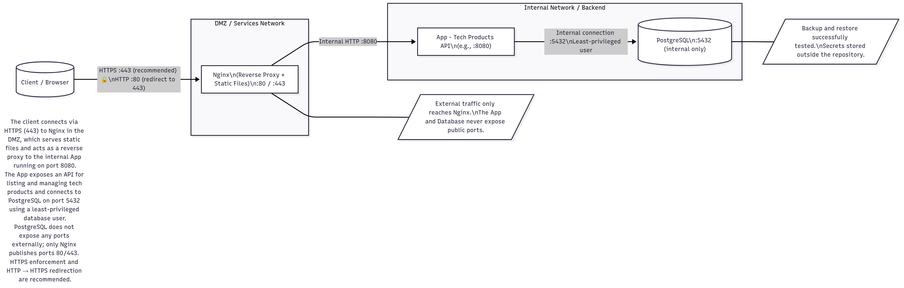
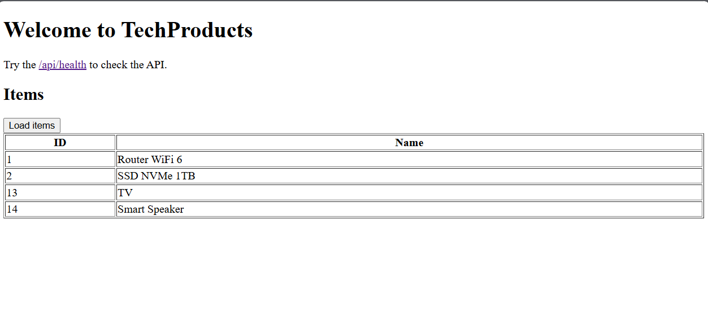
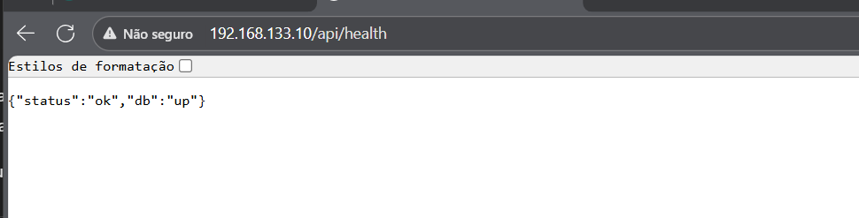
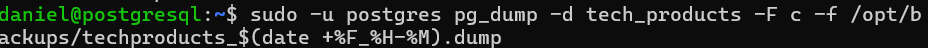

# 🧩 TechProducts – Web App with Nginx, FastAPI and PostgreSQL

> This repository is part of my **Homelab Cloud Portfolio**, showcasing a real-world backend–frontend setup with Nginx, FastAPI, and PostgreSQL.  
> It demonstrates how to serve static files, route API traffic securely, and document infrastructure like in a professional environment.

## 📚 Table of Contents
- [🧩 TechProducts – Web App with Nginx, FastAPI and PostgreSQL](#-techproducts--web-app-with-nginx-fastapi-and-postgresql)
  - [📚 Table of Contents](#-table-of-contents)
  - [🚀 Overview](#-overview)
  - [🏗️ Architecture](#️-architecture)
  - [⚙️ Technologies](#️-technologies)
  - [🧩 Project Structure](#-project-structure)
  - [🧭 How to Run (Manual Setup)](#-how-to-run-manual-setup)
  - [🔍 Healthcheck](#-healthcheck)
  - [💾 Backup \& Restore](#-backup--restore)
  - [🧠 Key Decisions](#-key-decisions)
  - [📊 Observability](#-observability)
  - [🧰 Useful Commands](#-useful-commands)
  - [🔒Security Checklist](#security-checklist)
  - [📸 Screenshots](#-screenshots)
  - [👤 Author:](#-author)

## 🚀 Overview

**TechProducts** is a small web application that lists and manages technology products through a REST API built with **FastAPI**, served behind an **Nginx reverse proxy**, and connected to a **PostgreSQL** database.

The system includes:  
- Static web interface served by **Nginx**  
- Backend API implemented with **FastAPI**  
- Database using **PostgreSQL 15**  
- Observability with **Prometheus & Grafana**  
- Technical documentation (Runbook, ADRs, Reverse Proxy config)

## 🏗️ Architecture

For the full diagram source, see [`docs/diagrams/architecture.md`](docs/diagrams/architecture.md)

**Network design:**  
- **DMZ:** Nginx serves static files and forwards API traffic  
- **LAN:** FastAPI app communicates with PostgreSQL internally  
- **Security:** No external ports open for the database



## ⚙️ Technologies

| Layer | Technology | Description |
|-------|-------------|-------------|
| Web Server | **Nginx** | Serves static frontend and acts as reverse proxy |
| Backend | **FastAPI (Python)** | REST API for Tech Products |
| Database | **PostgreSQL 15** | Internal database for data persistence |
| Observability | **Prometheus + Grafana** | Metrics and dashboards |
| Docs | **Markdown (.md)** | ADRs, Runbook, Reverse Proxy documentation |


## 🧩 Project Structure

```
homelab-tech-products
├─ app/                      # FastAPI source code
├─ infra/
│  └─ nginx/                 # Nginx configuration + reverse proxy
├─ static_site/              # Static HTML/JS frontend
├─ docs/
│  ├─ diagrams/              # Architecture diagram
│  ├─ decisions/             # ADR (architecture decisions)
│  ├─ runbooks/              # Deploy & restore procedures
│  └─ screenshots/           # Visual evidence
├─ .env.example              # Environment variable template
└─ README.md                 # This file
```

## 🧭 How to Run (Manual Setup)

Nginx proxies `/api/*` requests to FastAPI (`192.168.133.1:8000`) and serves the static frontend on `/`.

```bash
# 1️⃣ Create Python virtual environment
python -m venv .venv && source .venv/bin/activate

# 2️⃣ Install dependencies
pip install -r requirements.txt

# 3️⃣ Run the backend
uvicorn app.main:app --host 0.0.0.0 --port 8000

# 4️⃣ Deploy frontend static files (once)
sudo mkdir -p /var/www/techProducts/html
sudo cp -r static_site/* /var/www/techProducts/html/

# 5️⃣ Reload Nginx
sudo nginx -t && sudo systemctl reload nginx
```

## 🔍 Healthcheck
- Endpoint: GET /api/health  
- Expected Response:
`{"status": "ok", "db": "up"}`


## 💾 Backup & Restore

See `docs/runbooks/deploy_restore.md` for detailed commands using `pg_dump` and `pg_restore`.


## 🧠 Key Decisions
| ID | Decision | Summary |
|----|-----------|----------|
| **ADR-001** | [Use FastAPI over Flask](docs/decisions/ADR-001-use-fastapi-over-flask.md) | Type safety, async support, auto-generated docs |
| **ADR-002** | [Use Nginx as Reverse Proxy](infra/nginx/reverse-proxy.md) | Layer separation, security, and static file serving |
 
## 📊 Observability
The project can export metrics using `prometheus-fastapi-instrumentator`.


## 🧰 Useful Commands
```
# Validate Nginx configuration
sudo nginx -t

# Check FastAPI health directly
curl -i http://192.168.133.1:8000/api/health

# Test API through Nginx
curl -i http://localhost/api/health
```

## 🔒Security Checklist
 - Only Nginx exposes port 80 (App & DB private)
 - Basic security headers enabled
 - No sensitive data in repo (.env in .gitignore)
 - Backups tested (Runbook validated)

## 📸 Screenshots

Below are example screenshots showing different parts of the project:

| Architecture | Frontend |
|---------------|-----------|
|  |  |

| Healthcheck API | Database Backup |
|------------------|----------------|
|  |  |


## 👤 Author:
**Daniel Serrano Segura**  
*Homelab & Cloud Engineer in training*  
**“From Linux to Homelab, Cloud Projects and Beyond”**

License:
MIT License © 2025 – TechProducts Project
